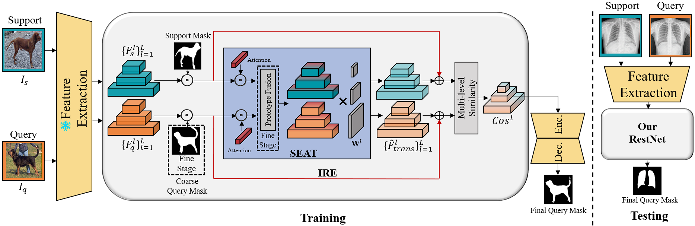

# RestNet: Boosting Cross-Domain Few-Shot Segmentation with Residual Transformation Network
[[Paper]](https://arxiv.org/abs/2308.13469)
[[Checkpoint]](https://drive.google.com/drive/folders/18nvsICSZziMIddKNvnyQjZpDWhblByu8?usp=sharing)

<p align="middle">
    
</p>

## Datasets

* **PASCAL VOC2012**:

    Download PASCAL VOC2012 devkit (train/val data):
    ```bash
    wget http://host.robots.ox.ac.uk/pascal/VOC/voc2012/VOCtrainval_11-May-2012.tar
    ```
    Download PASCAL VOC2012 SDS extended mask annotations from [[Google Drive](https://drive.google.com/file/d/10zxG2VExoEZUeyQl_uXga2OWHjGeZaf2/view?usp=sharing)].

* **FSS-1000**:

    Home: https://github.com/HKUSTCV/FSS-1000

    Direct: https://drive.google.com/file/d/16TgqOeI_0P41Eh3jWQlxlRXG9KIqtMgI/view

* **ISIC2018**:

    Home: http://challenge2018.isic-archive.com

    Direct (must login): https://challenge.isic-archive.com/data#2018

* **Chest X-ray**:

    Home: https://www.ncbi.nlm.nih.gov/pmc/articles/PMC4256233/

    Direct: https://www.kaggle.com/datasets/nikhilpandey360/chest-xray-masks-and-labels


## Training
> ### PASCAL VOC
> ```bash
> python train.py --backbone {vgg16, resnet50} 
>                 --fold 4 
>                 --benchmark pascal
>                 --lr 1e-3
>                 --bsz 20
>                 --logpath "your_experiment_name"
> ```

## Testing
> ### FSS-1000
> ```bash
> python test.py --backbone {vgg16, resnet50} 
>                --benchmark fss 
>                --nshot {1, 5} 
>                --load "path_to_trained_model/best_model.pt"
> ```

> ### ISIC
> ```bash
> python test.py --backbone {vgg16, resnet50} 
>                --fold {0, 1, 2, 3} 
>                --benchmark isic 
>                --nshot {1, 5} 
>                --load "path_to_trained_model/best_model.pt"
> ```

> ### Chest X-ray
> ```bash
> python test.py --backbone {vgg16, resnet50} 
>                --benchmark lung 
>                --nshot {1, 5} 
>                --load "path_to_trained_model/best_model.pt"
> ```


## Acknowledgement
The implementation is highly based on [HSNet](https://github.com/juhongm999/hsnet) and [PATNet](https://github.com/slei109/PATNet/tree/master). <br>
Thank them for their great work.


## Citation
```shell
@misc{huang2023restnet,
      title={RestNet: Boosting Cross-Domain Few-Shot Segmentation with Residual Transformation Network}, 
      author={Xinyang Huang and Chuang Zhu and Wenkai Chen},
      year={2023},
      eprint={2308.13469},
      archivePrefix={arXiv},
      primaryClass={cs.CV}
}
```

## Contact

Xinyang Huang ([hsinyanghuang7@gmail.com](hsinyanghuang7@gmail.com))

If you have any questions, you can contact us directly.

